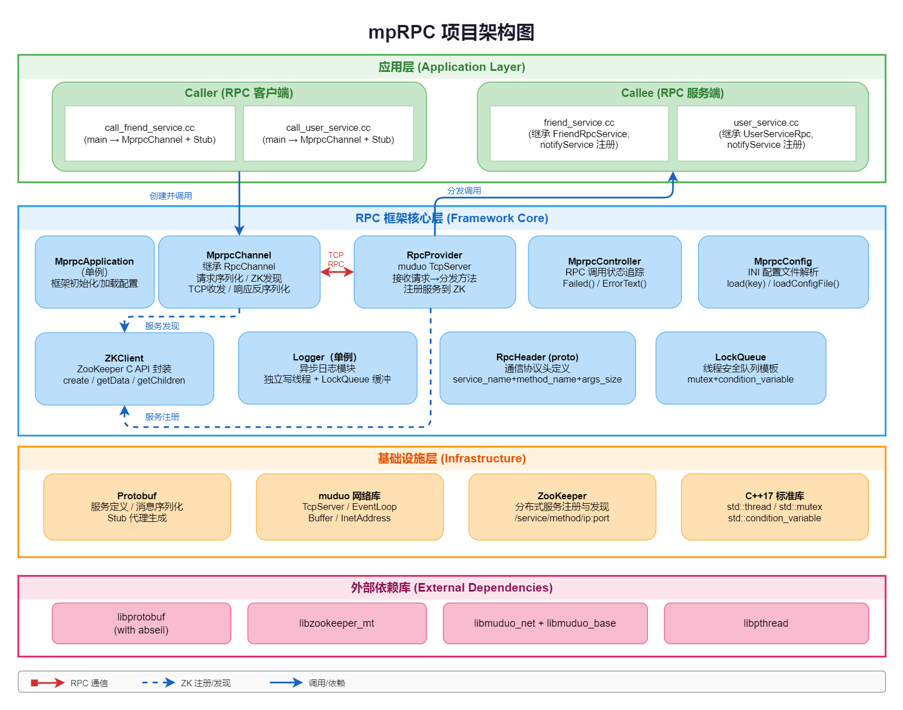
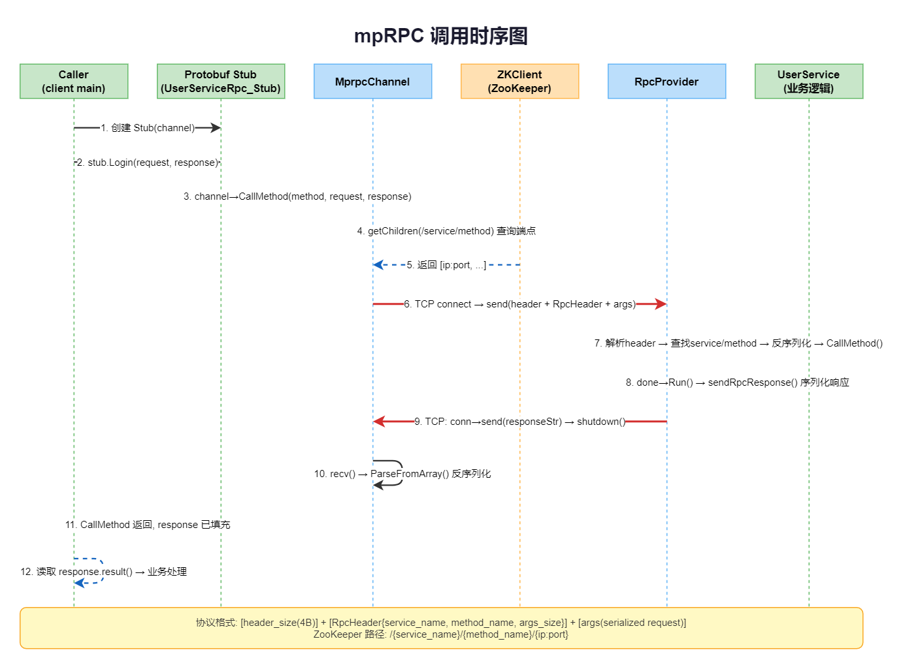
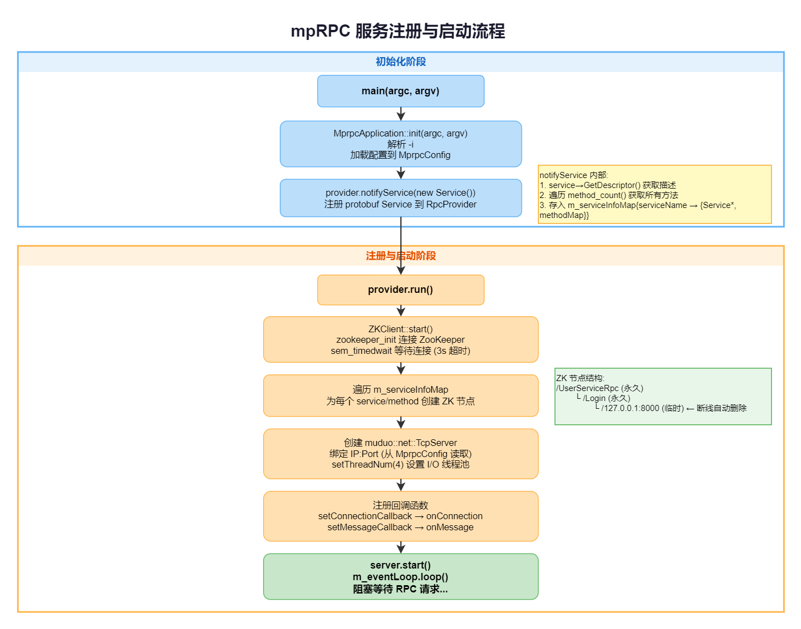
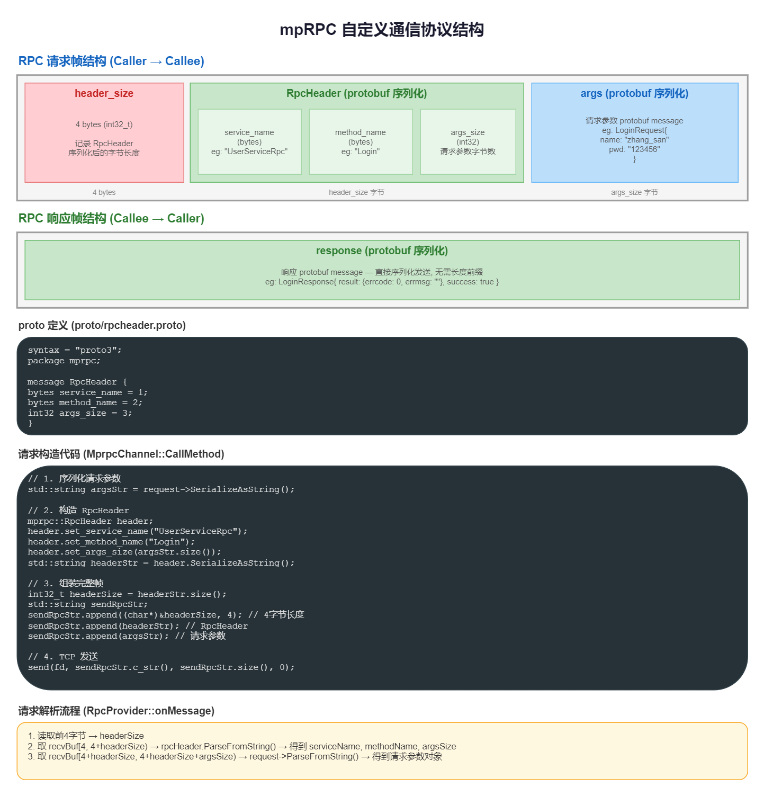

# mpRPC — 轻量级 C++ RPC 框架

mpRPC 是一个基于 **Protobuf**（服务定义与序列化）、**muduo**（高性能 TCP 网络库）和 **ZooKeeper**（服务注册与发现）构建的轻量级 C++ RPC（远程过程调用）框架。

## 功能特性

- **Protobuf 服务定义** — 使用 `.proto` 文件定义服务和方法，自动生成 Stub 代理类
- **ZooKeeper 服务注册与发现** — Provider 启动时自动注册到 ZK，Consumer 通过 ZK 发现服务端点
- **自定义二进制通信协议** — 紧凑的 `header_size + RpcHeader + args` 帧格式，基于 Protobuf 序列化
- **高性能网络层** — 基于 muduo 的 Reactor 模型，支持多 I/O 线程
- **异步日志模块** — 独立写线程 + 线程安全队列缓冲，按日期滚动写入日志文件
- **短连接模式** — 每次 RPC 调用独立 TCP 连接，简单可靠

## 依赖项

| 依赖 | 说明 |
|------|------|
| Protobuf (with abseil) | 服务定义、消息序列化/反序列化 |
| muduo (net + base) | 高性能 TCP 网络库 (TcpServer, EventLoop, Buffer) |
| ZooKeeper C Client (`zookeeper_mt`) | 分布式服务注册与发现 |
| pthread | POSIX 线程库 |
| C++17 | 语言标准 (`std::thread`, `std::mutex`, `std::condition_variable`) |

## 快速开始

### 1. 构建

```bash
# 一键构建（清理 build/ → cmake → make）
./autobuild.sh

# 或手动构建
mkdir -p build && cd build
cmake .. && make
```

构建产物：
- `lib/libmprpc.a` — 框架静态库
- `bin/callee` — RPC 服务端示例
- `bin/caller` — RPC 客户端示例

### 2. 配置

编辑 `config/mprpc.cnf`：

```ini
[rpc_server]
rpc_server_ip=127.0.0.1
rpc_server_port=8000

[zookeeper]
zookeeper_ip=127.0.0.1
zookeeper_port=2181
```

### 3. 运行

确保 ZooKeeper 已在配置的地址上运行，然后：

```bash
# 终端 1：启动服务端
./bin/callee -i config/mprpc.cnf

# 终端 2：启动客户端，发起 RPC 调用
./bin/caller -i config/mprpc.cnf
```

`-i` 参数指定配置文件路径，为必选项。

## 架构概览



### 核心类

| 类 | 角色 |
|---|------|
| `MprpcApplication` | 单例，框架入口。解析 CLI 参数 `-i <configfile>`，加载配置 |
| `MprpcConfig` | INI 风格配置文件解析器 |
| `RpcProvider` | RPC 服务提供方。基于 muduo TcpServer 接收请求，分发给注册的 Service，并将服务注册到 ZooKeeper |
| `MprpcChannel` | 继承 `google::protobuf::RpcChannel`，负责请求序列化、ZK 服务发现、TCP 收发、响应反序列化 |
| `MprpcController` | 继承 `google::protobuf::RpcController`，追踪 RPC 调用状态（失败/错误信息） |
| `ZKClient` | ZooKeeper C 客户端封装（`create` / `getData` / `getChildren`） |
| `Logger` | 异步日志模块，独立写线程 + `LockQueue` 缓冲，按日期写入 `YYYY-M-D.log` |
| `LockQueue<T>` | 线程安全队列模板（mutex + condition_variable），支持批量 drain |

### 调用链路





### 通信协议



### ZooKeeper 注册结构

```
/UserServiceRpc/Login/127.0.0.1:8000     ← 临时节点（Provider 离线后自动删除）
/UserServiceRpc/Register/127.0.0.1:8000
/FriendRpcService/GetFriendList/127.0.0.1:8000
```

## 目录结构

```
include/              — 框架公共头文件
src/                  — 框架核心实现（编译为 libmprpc.a）
proto/                — 内部通信协议定义 (rpcheader.proto)
example/
  proto/              — 示例服务 protobuf 定义 (user.proto, friend.proto)
  callee/             — RPC 服务端示例 (UserService, FriendService)
  caller/             — RPC 客户端示例
config/               — 配置文件模板 (mprpc.cnf)
diagrams/             — 项目架构图、时序图、流程图、协议结构图
```

## 添加新的 RPC 服务

### 1. 编写 `.proto` 文件

```protobuf
syntax = "proto3";
package example;

option cc_generic_services = true;  // 必须开启，用于生成 Stub

message HelloRequest { string name = 1; }
message HelloResponse { string message = 1; }

service HelloService {
    rpc SayHello(HelloRequest) returns(HelloResponse);
}
```

### 2. 生成 C++ 代码

```bash
protoc --cpp_out=. hello.proto
```

### 3. 服务端：实现并注册服务

```cpp
#include "hello.pb.h"
#include "mprpc_application.h"
#include "mprpc_provider.h"

class HelloServiceImpl : public example::HelloService {
public:
    void SayHello(google::protobuf::RpcController* controller,
                  const example::HelloRequest* request,
                  example::HelloResponse* response,
                  google::protobuf::Closure* done) override {
        response->set_message("Hello, " + request->name());
        done->Run();  // 回调：序列化响应并发送回客户端
    }
};

int main(int argc, char** argv) {
    MprpcApplication::init(argc, argv);
    RpcProvider provider;
    provider.notifyService(new HelloServiceImpl());
    provider.run();  // 阻塞等待 RPC 请求
    return 0;
}
```

### 4. 客户端：调用远程服务

```cpp
#include "hello.pb.h"
#include "mprpc_application.h"
#include "mprpc_channel.h"

int main(int argc, char** argv) {
    MprpcApplication::init(argc, argv);

    example::HelloRequest request;
    request.set_name("World");

    example::HelloResponse response;

    MprpcChannel channel;
    example::HelloService_Stub stub(&channel);
    stub.SayHello(nullptr, &request, &response, nullptr);

    std::cout << response.message() << std::endl;  // "Hello, World"
    return 0;
}
```

