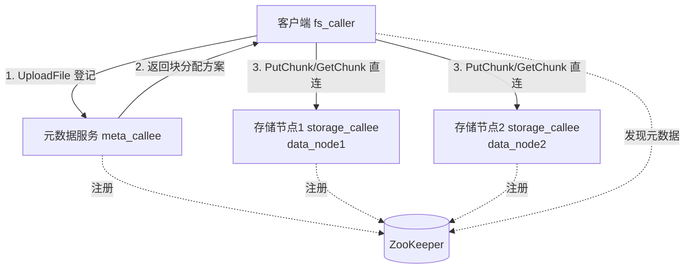
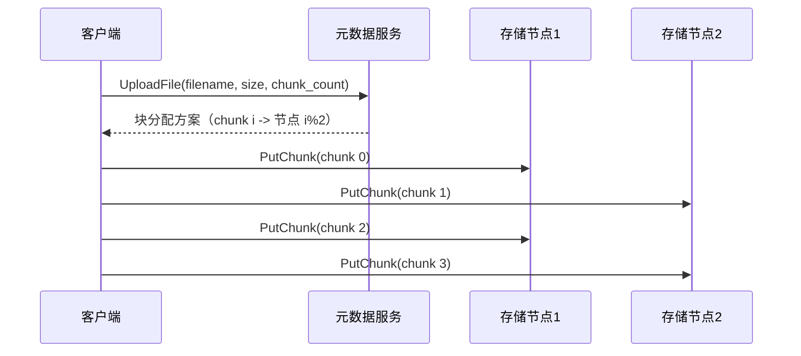

# 分布式文件存储系统（基于 mpRPC）

一个基于 mpRPC 框架实现的分布式文件存储系统基础版，演示文件分块、块分布多节点存储、元数据索引与故障转移。

## 系统组成

| 组件 | 可执行文件 | 职责 |
|------|-----------|------|
| 客户端 | `fs_caller` | 文件上传 / 下载 / 删除，按块位置直连存储节点 |
| 元数据服务 | `meta_callee` | 维护文件名 → 块位置映射，分配块到存储节点 |
| 存储服务 | `storage_callee` | 文件块落盘、读取、删除，可部署多个实例 |

## 架构



## 上传时序



## 构建

```bash
./autobuild.sh
```

产物：
- `bin/meta_callee` — 元数据服务端
- `bin/storage_callee` — 存储服务端
- `bin/fs_caller` — 客户端

## 运行

1. 确保 ZooKeeper 运行（默认 `127.0.0.1:2181`）

2. 启动元数据服务（终端 1）：

```bash
./bin/meta_callee -i config/filestore_meta.cnf
```

3. 启动存储节点 1（终端 2）：

```bash
./bin/storage_callee -i config/filestore_storage1.cnf
```

4. 启动存储节点 2（终端 3）：

```bash
./bin/storage_callee -i config/filestore_storage2.cnf
```

5. 上传文件：

```bash
./bin/fs_caller -i config/mprpc.cnf upload <本地文件路径>
```

6. 下载文件（输出到 `downloads/`）：

```bash
./bin/fs_caller -i config/mprpc.cnf download <远程文件名>
```

7. 删除文件：

```bash
./bin/fs_caller -i config/mprpc.cnf delete <远程文件名>
```

## 块分布策略

元数据服务按 `chunk_index % 存储节点数` 将文件块分配到各存储节点，客户端拿到块位置后通过 `MprpcChannel(ip, port)` 直连对应节点读写。

## 配置说明

- `config/filestore_meta.cnf` — 元数据服务配置，含 `storage_nodes`（存储节点列表，逗号分隔）
- `config/filestore_storage1.cnf` / `filestore_storage2.cnf` — 存储节点配置，含 `data_dir`（数据落盘目录）

## 目录结构

```
filestore/
  proto/file_storage.proto   — MetaServiceRpc + StorageServiceRpc 定义
  callee/meta_service.cc     — 元数据服务端
  callee/storage_service.cc  — 存储服务端
  caller/fs_caller.cc        — 客户端
  CMakeLists.txt
  file_storage.pb.cc/.h      — protoc 生成
```

## 诚实边界（基础版未实现）

- 元数据索引存内存，进程重启即失，未做持久化与副本一致性
- 存储节点列表静态配置，未做动态感知与选主
- 未做多副本冗余
