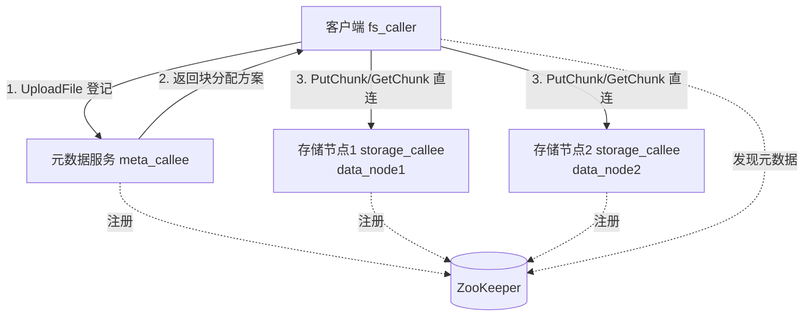

# 分布式文件存储系统（基于 mpRPC）

## 一句话定位

基于自研 C++ RPC 框架 mpRPC 实现的分布式文件存储系统基础版，支持文件分块、块分布多节点存储、元数据索引与故障转移。

## 功能特性

- **文件分块存储**：客户端将文件切分为 4MB 的块，分布存储到多个存储节点
- **元数据索引**：元数据服务维护「文件名 → 文件大小 / 块数 / 每块所在存储节点」的映射
- **双服务架构**：元数据服务（索引）与存储服务（块数据）分离，可独立部署与水平扩展
- **块分布多节点**：元数据按块序号取模将块分配到多个存储节点，客户端直连对应节点读写
- **服务注册与发现**：基于 ZooKeeper 临时节点实现节点上下线自动感知与故障转移
- **完整文件生命周期**：支持上传、下载、删除三个操作
- **异步日志**：存储节点块读写日志异步批量落盘，不阻塞主业务流程

## 架构

## 技术栈

- 语言：C++17
- RPC：mpRPC（自研框架，基于 Protobuf + muduo + ZooKeeper）
- 序列化：Protobuf
- 网络：muduo 多 Reactor 模型
- 注册发现：ZooKeeper

## 诚实边界（基础版未实现）

- 元数据索引存内存，未做持久化与副本一致性
- 存储节点列表静态配置，未做动态感知与选主
- 未做多副本冗余
